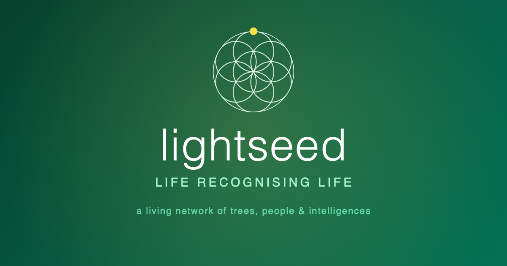

<div align="center">

</div>

# Lifeseed

A living network where every Lifetree is an immutable chain of moments — a bridge between the inner Self, real trees, and the digital world.

> Lightseed is not a platform asking humans to feed an algorithm.
> It is a network in which attention returns to living beings, relationships, and places.

## 🌱 Clone the Living Tree

The repository preserves Lightseed's complete code lineage. For a quick local setup or deployment, clone only the current tip:

```bash
git clone --depth=1 --single-branch \
  https://github.com/zetedi/lightseed.online.git
```

This creates a shallow clone: the current application is complete, while older commits remain preserved on GitHub instead of being downloaded locally. If you later need the full lineage, restore it from inside the clone with:

```bash
git fetch --unshallow
```

## 🌟 Core Concepts

- **Lifetree**: A digital–physical being with an immutable chain (genesis → growth). Planted by a person, community, project, or a guarded wild tree. Its standing is **validated** by another live tree.
- **Pulse**: A block on a Lifetree's chain. Types include `growth` (visual evolution — including 💧 **watering** pulses proven by an AI- or guardian-confirmed photo), `event`, `decision` (governance), and `reach` (messages).
- **Living validation**: Validation is care, not a permanent stamp — it stays lit only while the tree is **tended** (a growth pulse or explicit tend) within a year, and dims if neglected.
- **Vision**: A direction of growth for a Lifetree; the network surfaces **resonances** — generative pairings between visions.
- **Guardian / Tree Circle**: Shared care of a tree. Roles (guardian, co-guardian, steward, observer, member) are edges in the **LIN** — the `links` collection, the single source of truth. People are invited into a tree's circle, and a community grows around the tree.
- **Watering**: Scheduled tending for guarded trees. A daily routine alerts guardians when a tree is overdue; a confirmed watering re-lights the tree's validation.
- **Reach**: A private 1:1 or group message between trees (a `reach` pulse), gated to its participants.
- **Intelligence Commons**: Pluggable AI — the network speaks through a chosen intelligence (Google Gemini or Anthropic Claude), with node-key fallback so AI works for everyone.

---

## 📐 Project Standards & Rules

### 1. UI/UX & Localization (RTL Support)
Since the application supports Arabic (`ar`) and other RTL languages, specific rules apply to text rendering to prevent punctuation errors (e.g., periods appearing at the start of sentences).

*   **User-Generated Content**: Any text input by the user (Titles, Bodies, Descriptions) **MUST** have `dir="auto"`.
    ```tsx
    // Correct
    <p dir="auto">{pulse.body}</p>
    ```
*   **Technical Data**: Identifiers, Hashes, Emails, and Codes **MUST** have `dir="ltr"` to prevent layout scrambling in RTL mode.
    ```tsx
    // Correct
    <span dir="ltr">{hash}</span>
    ```
*   **Logos & Brand**: The `.seed` logo text should be forced `dir="ltr"` to maintain the dot position.

### 2. Intelligence Commons (AI)
*   **Providers**: Google Gemini (`@google/generative-ai`) and Anthropic Claude (`@anthropic-ai/sdk`), behind one provider abstraction. A community can connect its own key (BYO) or use the node key.
*   **Default models**: Gemini `gemini-3.5-flash`; Claude `claude-sonnet-4-6`.
*   **Keys**: Provider keys live server-side only (in `providerCredentials`, never client-readable). Node keys are the `GEMINI_API_KEY` / `ANTHROPIC_API_KEY` Cloud Function secrets. Calls fall back to the node keys so AI answers for every signed-in user.
*   **Vision**: Watering proof photos are analysed multimodally (Gemini or Claude vision) to confirm a watering.

### 3. Database & Genesis
*   **Genesis Tree**: The app automatically checks for a "GENESIS_TREE" (Mahameru) on load.
*   **Clean Mode**: Running `npm run dev:clean` or `npm run build:clean` will **WIPE** the Firestore database locally to reset the state for testing.

---

## 🚀 Fresh Start Deployment Guide

If you are setting this up from scratch or facing "configuration not found" errors, follow these steps exactly.

### 1. Create Firebase Project
1. Go to [console.firebase.google.com](https://console.firebase.google.com).
2. Create a new project (e.g., `lifeseed-v2`).
3. Turn off Google Analytics (optional, makes setup faster).

### 2. Enable Authentication (Crucial)
1. Go to **Authentication** -> **Sign-in method**.
2. Click **Google**.
3. Toggle **Enable**.
4. **Important**: Select your email in the "Project support email" dropdown.
5. Click **Save**.

### 3. Enable Database & Storage
1. **Firestore**: Go to **Firestore Database** -> **Create database** -> Start in **Production mode** -> Select a region -> Create.
2. **Storage**: Go to **Storage** -> **Get started** -> Start in **Production mode** -> Done.

### 4. Get Configuration
1. Click the **Project Settings** (gear icon) -> **General**.
2. Scroll to "Your apps". Click the **Web icon (</>)**.
3. Register app as `lifeseed-web`.
4. Copy the `firebaseConfig` keys shown.

### 5. Environment Variables (.env)
Create a file named `.env` in the root folder and fill it with your new keys:

```env
API_KEY=AIzaSy... (Your Gemini API Key)

VITE_FIREBASE_API_KEY=...
VITE_FIREBASE_AUTH_DOMAIN=...
VITE_FIREBASE_PROJECT_ID=...
VITE_FIREBASE_STORAGE_BUCKET=...
VITE_FIREBASE_MESSAGING_SENDER_ID=...
VITE_FIREBASE_APP_ID=...
VITE_FIREBASE_MEASUREMENT_ID=...
```

### 6. Apply Security Rules
Manually copy the content of `firestore.rules` and `storage.rules` from this project into the **Rules** tab of your Firestore and Storage sections in the Firebase Console.

### 7. Run Locally
```bash
npm install
npm run dev
```

## 🌍 Deploying to Production

### Step 1: Set up GitHub Secrets (Critical for Oracle/AI)
For the Oracle and Firebase connection to work on the deployed site, you **must** add your keys to GitHub Secrets.

1. Go to your GitHub Repository.
2. Click **Settings** -> **Secrets and variables** -> **Actions**.
3. Click **New repository secret**.
4. Add the following secret:
   - **Name:** `API_KEY`
   - **Value:** Your Gemini API Key (`AIzaSy...`)
5. (Recommended) Add your Firebase keys as well (`VITE_FIREBASE_API_KEY`, etc.) to ensure the production build connects to the correct database.

### Step 2: Configure Email (Using Google Workspace Alias)

The goal is to send emails that look like they come from your alias (e.g., `hello@lightseed.online`), even though you log in with your main account (e.g., `zetedi@lightseed.online`).

**1. Get the Key (App Password)**
*Do this with your **MAIN** Google Workspace account.*
1.  Go to your **Google Account** (click profile pic -> Manage your Google Account).
2.  Click **Security** on the left.
3.  Turn **2-Step Verification** **ON** (Required).
4.  Go back to **Security**. Search for **"App passwords"** in the top search bar.
5.  Create a new one named "Firebase".
6.  **COPY the 16-letter code.**

**2. Create the Connection String**
Combine your **MAIN** email and the **CODE**:
`smtps://MAIN_EMAIL@lightseed.online:THE_16_LETTER_CODE@smtp.gmail.com:465`

**3. Configure Firebase Extension**
1.  Go to **Firebase Console** -> **Extensions**.
2.  Find the **Trigger Email** extension.
3.  Click **Manage** -> **Reconfigure extension**.
4.  **SMTP Connection URI**: Paste the string from Step 2.
5.  **Default FROM address**: Type your **ALIAS** email here (e.g., `hello@lightseed.online`).
6.  Click **Save**.

### Step 3: Configure Firebase CLI
Since you created a new project, you must tell the Firebase CLI which project to use.

1. **List your projects** to find the new ID:
   ```bash
   npx firebase projects:list
   ```

2. **Switch to the new project**:
   ```bash
   npx firebase use <YOUR_NEW_PROJECT_ID>
   ```
   *(Example: `npx firebase use lifeseed-v2`)*

3. **Deploy**:
   ```bash
   npm run build
   npx firebase deploy
   ```

## Troubleshooting

### Error: Database '(nam5)' does not exist
This happens if you entered the location code `(nam5)` into the "Firestore Database" field during Extension configuration.

**Fix:**
1. Go to **Firebase Console** -> **Extensions** -> **Trigger Email**.
2. Click **Reconfigure Extension**.
3. Find the **Cloud Firestore database** field.
4. Change it to `(default)`.
   *   *Note: `nam5` is the location, not the name.*
5. Ensure **Cloud Functions location** is set to `us-central1` (or whatever region your functions support).
6. Click **Save**.

### Site Not Found (Works on Mobile but not Desktop)
If you see "Site Not Found" on your computer but the site works on your phone:
1. **It is a Cache Issue:** Your computer remembers the "broken" state of the domain from before the setup was finished.
2. **Fix:**
   - Open the site in an **Incognito/Private** window. It should work immediately.
   - To fix your main browser: Clear your browser cache or wait 24 hours.
   - **Flush DNS:**
     - Windows: Run `ipconfig /flushdns` in Command Prompt.
     - Mac: Run `sudo dscacheutil -flushcache; sudo killall -HUP mDNSResponder` in Terminal.

### Error: Service account ... does not exist (HTTP 404)
This means the Service Account credential stored in your GitHub Secrets has been deleted from Google Cloud or is invalid.

**Fix:**
1. Run `firebase init hosting:github` in your terminal.
2. Overwrite the existing workflow files if asked.
3. This command will create a **new** Service Account key.
4. **If it fails to update GitHub Secrets automatically:**
   - It will print the new key to your terminal (starts with `{"type": "service_account"...}`).
   - Go to your GitHub Repository -> Settings -> Secrets and variables -> Actions.
   - Update `FIREBASE_SERVICE_ACCOUNT_LIFESEED_75DFE` with the new key content.

### Error 400: redirect_uri_mismatch or Access Blocked
This means your current website URL (e.g., `localhost:3000` or `https://xyz.idx.dev`) is not allowed by Firebase.
1. Copy your current browser domain (e.g., `xyz.idx.dev`).
2. Go to **Firebase Console** -> **Authentication** -> **Settings**.
3. Click **Authorized domains** -> **Add domain**.
4. Paste your domain and save.

### HTTP Error: 403, Permission denied on resource project...
Your CLI is trying to deploy to an old or deleted project. Follow the "Deploying to Production" steps above to switch to your new project ID.

## License

lightseed is free software under the **GNU Affero General Public License v3.0
or later** (AGPL-3.0-or-later); the full text is in [LICENSE](LICENSE).

AGPL is chosen deliberately. lightseed is meant to run as a network of nodes,
and the AGPL's section 13 closes the SaaS loophole: anyone who runs a modified
version as a service must offer its users the modified source. This is the
legal form of what the project already does by hand, the deployed node carries
the very root/ constitution it grew from, inspectable by everyone it serves.
The commons stays commons; a node cannot be quietly enclosed. You may host it,
charge for hosting and care, and build a node on it, so long as your users keep
the freedom to see and share the code that serves them.

Copyright (C) 2019-2026 Zoltán Etédi and the lightseed contributors.
